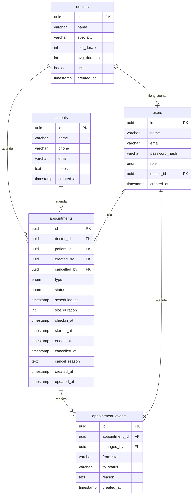

# Planificación — Sistema de agenda médica

> Documento de contexto y decisiones de negocio.  
> Leer completo antes de iniciar desarrollo. Los prompts de ejecución están en `clinica-prompts.md`.

---

## El problema

Una clínica privada con **8 médicos** atiende entre 60 y 80 pacientes al día. El flujo actual:

1. Pacientes agendan por WhatsApp
2. La recepcionista anota en Excel
3. Los médicos reciben una hoja impresa cada mañana

**Problemas críticos:**
- Cambios, cancelaciones y walk-ins no se reflejan en tiempo real
- No hay validación de conflictos → dos pacientes pueden quedar a la misma hora con el mismo médico
- El médico no sabe si hay alguien esperando o si puede salir

**Qué pide la directora:**
- Cada médico ve su agenda del día en tiempo real con estados claros
- El sistema no permite doble-agendar al mismo médico en el mismo horario
- Al cierre del día: resumen de atendidas, canceladas y no-shows por médico

---

## Decisiones de negocio

### Duración de cita
- **MVP:** slot fijo de **30 minutos** por médico, editable por el admin desde su panel
- **V2:** el sistema calcula un promedio histórico real usando los timestamps de `started_at` → `ended_at`
- El promedio solo se usa como referencia cuando el médico acumula **mínimo 10 consultas** con ambos timestamps completos
- Se excluyen del cálculo duraciones menores a 5 min o mayores a 90 min (errores de registro)
- El doctor no interactúa con el sistema para registrar tiempos — todo viene de cambios de estado que hace el admin

### Cancelaciones
- **Pueden cancelar:** admin y doctor
- Toda cancelación exige una razón (campo obligatorio)
- Toda cancelación genera un evento visible en el panel del admin con quién canceló, cuándo y por qué
- Queda registrado en `appointment_events` con trazabilidad completa

### Walk-ins
- No usan slots — no bloquean tiempo en la agenda
- El admin los registra al momento de llegar; nacen con estado `waiting`
- Aparecen en la agenda del médico como **cola de espera separada**, visible pero sin desplazar citas agendadas
- El admin decide cuándo mandarlos a consulta según los huecos naturales
- Una vez en `in_consultation`, el doctor los ve igual que cualquier cita

### No-show
- El admin hace **check-in manual** cuando el paciente llega (transición a `arrived`)
- Si la cita no avanza a `arrived` dentro de **15 minutos** de su hora programada, el sistema la marca automáticamente como `no_show`
- El timer **no aplica** si la cita ya avanzó a `in_consultation` o posterior — protege contra olvidos del admin
- Un no-show automático puede revertirse manualmente por el admin si hubo error de registro

---

## Flujo de estados

```
CITA AGENDADA (type = scheduled):
  scheduled → arrived         admin hace check-in
  arrived   → in_consultation admin manda al paciente con el médico
  in_consultation → attended  admin confirma que el paciente salió
  scheduled → cancelled       admin o doctor (con razón obligatoria)
  scheduled → no_show         sistema automático a los 15 min sin check-in

WALK-IN (type = walkin):
  waiting   → in_consultation admin lo canaliza con el médico
  in_consultation → attended  admin confirma salida
  waiting   → cancelled       admin (con razón)
```

### Quién ejecuta cada transición

| Transición                      | Actor                        |
|---------------------------------|------------------------------|
| `scheduled` → `arrived`         | Admin (check-in manual)      |
| `arrived` → `in_consultation`   | Admin (manda al paciente)    |
| `in_consultation` → `attended`  | Admin (paciente sale)        |
| cualquiera → `cancelled`        | Admin o Doctor               |
| `scheduled` → `no_show`         | Sistema (automático, 15 min) |
| `waiting` → `in_consultation`   | Admin (walk-in)              |

### Transiciones inválidas (el sistema las bloquea)

- Cualquier estado terminal (`attended`, `cancelled`, `no_show`) → cualquier otro estado
- Saltarse pasos: `scheduled` → `in_consultation` sin pasar por `arrived`
- `arrived` → `no_show` (si ya hizo check-in, no puede ser no-show)

---

## Roles

### Admin / Recepcionista
- Crear, editar y cancelar citas
- Registrar walk-ins
- Hacer check-in de pacientes
- Cambiar todos los estados
- Ver agenda de todos los médicos simultáneamente
- Ver y ejecutar el resumen del día

### Doctor
- Ver **solo su propia** agenda en tiempo real
- Ver el estado de cada cita
- Cancelar citas (genera notificación al admin)
- No puede ver agendas de otros médicos
- No hace check-in ni cambia estados operativos

### Director (puede ser el mismo admin)
- Acceso al reporte del día: atendidas, canceladas, no-shows por médico
- Solo lectura de reportes

---

## Modelo de datos

### `doctors`
| Campo          | Tipo      | Notas                                      |
|----------------|-----------|--------------------------------------------|
| `id`           | UUID PK   |                                            |
| `name`         | VARCHAR   |                                            |
| `specialty`    | VARCHAR   |                                            |
| `slot_duration`| INTEGER   | Minutos. Default 30. Editable por admin    |
| `avg_duration` | INTEGER   | Calculado. Null hasta tener 10+ registros  |
| `active`       | BOOLEAN   |                                            |
| `created_at`   | TIMESTAMP |                                            |

### `users`
| Campo           | Tipo      | Notas                                         |
|-----------------|-----------|-----------------------------------------------|
| `id`            | UUID PK   |                                               |
| `name`          | VARCHAR   |                                               |
| `email`         | VARCHAR   | UNIQUE                                        |
| `password_hash` | VARCHAR   | Nunca se expone en respuestas API             |
| `role`          | ENUM      | `admin` \| `director` \| `doctor`             |
| `doctor_id`     | UUID FK   | Nullable. Solo existe si `role = doctor`      |
| `created_at`    | TIMESTAMP |                                               |

### `patients`
| Campo        | Tipo      | Notas    |
|--------------|-----------|----------|
| `id`         | UUID PK   |          |
| `name`       | VARCHAR   |          |
| `phone`      | VARCHAR   |          |
| `email`      | VARCHAR   | Nullable |
| `notes`      | TEXT      | Nullable |
| `created_at` | TIMESTAMP |          |

### `appointments`
| Campo           | Tipo      | Notas                                                    |
|-----------------|-----------|----------------------------------------------------------|
| `id`            | UUID PK   |                                                          |
| `doctor_id`     | UUID FK   | → doctors                                                |
| `patient_id`    | UUID FK   | → patients                                               |
| `created_by`    | UUID FK   | → users. Siempre tiene valor                             |
| `cancelled_by`  | UUID FK   | → users. Nullable. Solo si fue cancelada                 |
| `type`          | ENUM      | `scheduled` \| `walkin`                                  |
| `status`        | ENUM      | `scheduled` \| `waiting` \| `arrived` \| `in_consultation` \| `attended` \| `cancelled` \| `no_show` |
| `scheduled_at`  | TIMESTAMP | Nullable. Null si es walk-in                             |
| `slot_duration` | INTEGER   | Copia del slot del médico al momento de agendar          |
| `checkin_at`    | TIMESTAMP | Nullable. Cuando el admin marca `arrived`                |
| `started_at`    | TIMESTAMP | Nullable. Cuando entra a consulta                        |
| `ended_at`      | TIMESTAMP | Nullable. Cuando sale. Fuente del promedio histórico     |
| `cancelled_at`  | TIMESTAMP | Nullable                                                 |
| `cancel_reason` | TEXT      | Nullable. Obligatorio si `cancelled_by` tiene valor      |
| `created_at`    | TIMESTAMP |                                                          |
| `updated_at`    | TIMESTAMP |                                                          |

**Nota sobre `status` y `type`:**
- `waiting` es el estado inicial exclusivo de walk-ins
- `scheduled` como status es el estado inicial de citas programadas
- Los dos valores comparten nombre por coincidencia semántica, no por error

### `appointment_events`
| Campo            | Tipo      | Notas                                             |
|------------------|-----------|---------------------------------------------------|
| `id`             | UUID PK   |                                                   |
| `appointment_id` | UUID FK   | → appointments                                    |
| `changed_by`     | UUID FK   | → users. **Nullable** — null significa "sistema"  |
| `from_status`    | VARCHAR   |                                                   |
| `to_status`      | VARCHAR   |                                                   |
| `reason`         | TEXT      | Nullable. Obligatorio cuando `to_status = cancelled` |
| `created_at`     | TIMESTAMP |                                                   |

Esta tabla es la **fuente de verdad para reportes**. Una cita que se cancela y re-agenda registra dos eventos distintos — el reporte del día contará correctamente ambas acciones.

---

## Diagrama de datos



---

## Reglas de negocio — implementación en backend

### 1. Anti doble-agenda
Antes de insertar una cita, verificar que no exista ninguna cita del mismo médico cuyo rango `[scheduled_at, scheduled_at + slot_duration]` se solape con el rango solicitado, excluyendo citas con status `cancelled` y `no_show`.

```sql
SELECT id FROM appointments
WHERE doctor_id = $1
  AND status NOT IN ('cancelled', 'no_show')
  AND scheduled_at < $3               -- nueva_hora + slot
  AND scheduled_at + (slot_duration * interval '1 minute') > $2  -- nueva_hora
```

Si retorna filas → `409 Conflict`.

### 2. No-show automático
Job con `node-cron` que corre cada minuto:

```
Buscar citas WHERE:
  status = 'scheduled'
  AND scheduled_at < NOW() - INTERVAL '15 minutes'

Para cada una:
  UPDATE status = 'no_show'
  INSERT appointment_events (from: 'scheduled', to: 'no_show', changed_by: NULL)
```

El `changed_by = NULL` es semánticamente correcto: el sistema lo ejecutó, no un usuario.

### 3. Máquina de estados
Las transiciones válidas se validan en una capa de servicio antes de hacer cualquier UPDATE:

```
TRANSICIONES PERMITIDAS:
  scheduled      → arrived, cancelled, no_show
  waiting        → in_consultation, cancelled
  arrived        → in_consultation, cancelled
  in_consultation → attended, cancelled
  attended       → (ninguna)
  cancelled      → (ninguna)
  no_show        → scheduled  ← única excepción: reversión manual por admin
```

Si la transición solicitada no está en la lista → `422 Unprocessable Entity`.

### 4. Promedio histórico
Al marcar una cita como `attended`, calcular si el médico ya tiene 10+ registros válidos:

```sql
SELECT AVG(EXTRACT(EPOCH FROM (ended_at - started_at)) / 60)
FROM appointments
WHERE doctor_id = $1
  AND ended_at IS NOT NULL
  AND started_at IS NOT NULL
  AND EXTRACT(EPOCH FROM (ended_at - started_at)) / 60 BETWEEN 5 AND 90
HAVING COUNT(*) >= 10
```

Si retorna valor → `UPDATE doctors SET avg_duration = $resultado`.

---

## Manejo de errores visible (UI)

Tres casos obligatorios que deben mostrarse en interfaz, no solo en consola:

### Error 1 — Conflicto de horario
- **Cuándo:** Al intentar agendar en un slot ya ocupado
- **Prevención:** Los slots ocupados se muestran deshabilitados en el selector de hora antes de intentar guardar
- **Si llega al backend:** `409 Conflict`
- **En UI:** Banner rojo inline dentro del formulario: *"El Dr. [nombre] ya tiene una cita a las [hora]. Elige otro horario."*
- **No usar:** `alert()` del navegador ni toast que desaparece solo

### Error 2 — Transición de estado inválida
- **Cuándo:** Intento de cambiar a un estado que la máquina no permite
- **Prevención:** Los botones de acción solo muestran las transiciones válidas para el estado actual
- **Si llega al backend:** `422 Unprocessable Entity`
- **En UI:** Mensaje inline en la tarjeta de la cita: *"Esta cita ya fue atendida y no puede modificarse."*

### Error 3 — Acción no autorizada por rol
- **Cuándo:** Doctor intenta ver agenda de otro médico; cualquier rol intenta una acción fuera de sus permisos
- **Backend:** `403 Forbidden`
- **En UI:** Estado vacío con mensaje claro: *"No tienes permiso para ver esta sección."* — sin redirección silenciosa al login, sin pantalla en blanco

---

## Heurísticas de Nielsen aplicadas

| Heurística | Aplicación concreta |
|---|---|
| Visibilidad del estado | Color + fondo de fila cambia por estado. El médico ve de un vistazo quién está en consulta |
| Prevención de errores | Slots ocupados deshabilitados visualmente. Botones de transición solo muestran opciones válidas |
| Correspondencia con el mundo real | Estados en lenguaje de clínica: "Esperando", "En consulta", "Atendido" — no `in_consultation` |
| Control y libertad | No-show automático puede revertirse manualmente. Cancelaciones tienen razón visible |
| Consistencia | El mismo chip de estado usa el mismo color en las vistas de admin y doctor |
| Diagnóstico de errores | Mensajes que dicen qué pasó y cómo resolverlo, no solo "Error 422" |

---

## Stack

| Capa | Tecnología |
|---|---|
| Backend | Node.js + Express + TypeScript |
| ORM | Prisma |
| Base de datos | PostgreSQL |
| Autenticación | JWT (access token, 8h de expiración) |
| Jobs/Cron | node-cron |
| Frontend | React + Vite |
| Tiempo real | Polling cada 30s (Socket.io como mejora futura) |
| Testing | Jest + Supertest |

---

## Seguridad mínima requerida

- Credenciales de BD solo en `.env` — incluir `.env.example` con claves vacías y `.env` en `.gitignore`
- `password_hash` nunca se incluye en respuestas de la API
- Queries via Prisma (parametrizadas) — sin interpolación de strings en SQL
- El campo `notes` de pacientes y `cancel_reason` deben sanitizarse antes de persistir
- El doctor solo puede hacer GET de sus propias citas — validado en middleware, no solo en frontend
